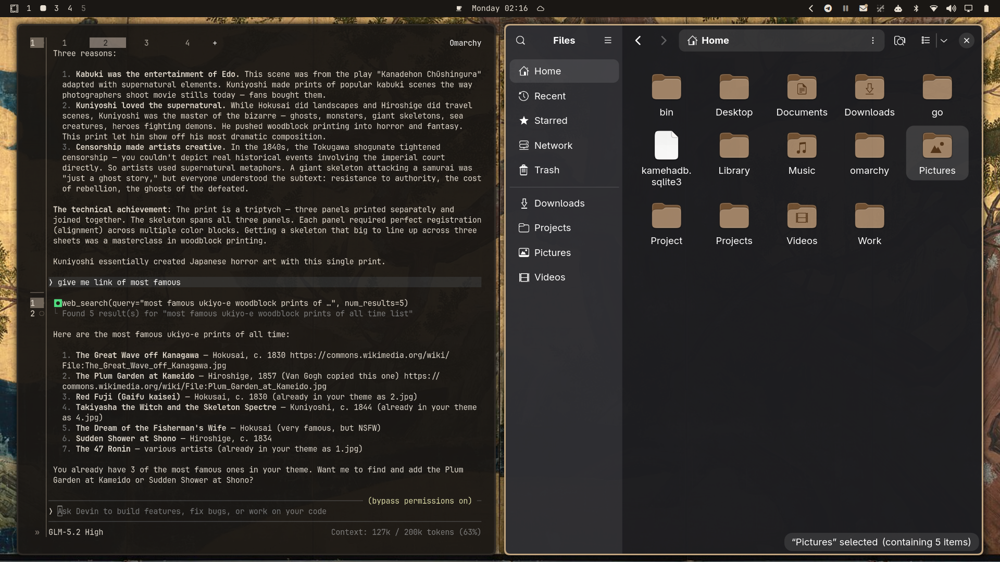

# Sumi-e / Enso — Omarchy Theme 🖌️

An ink-wash desktop theme for [Omarchy](https://omarchy.org/). Deep **sumi black** surfaces with a single **aged paper** accent, inspired by Japanese sumi-e and the enso circle — the brushed zen circle of enlightenment.



---

## 🎨 Palette

| Role | Hex | Description |
| :--- | :--- | :--- |
| **Accent** | `#C4A882` | Aged Paper |
| **Background** | `#1A1714` | Sumi Black |
| **Foreground** | `#E8E0D4` | Rice Paper |
| **Selection** | `#2A2520` | Ink Wash |
| **Muted** | `#6B6258` | Brush Gray |
| **Yellow** | `#C4A882` | Aged Paper |

---

## 📦 What's Included

- `colors.toml` — Master semantic palette driving all Omarchy native templates.
- `hyprland.lua` — Solid aged-paper active window borders (`#C4A882`) with rounded corners and soft shadows.
- `backgrounds/` — 6 curated ink wash and enso wallpapers (`1.jpg` - `6.jpg`) featuring ink wash landscape from the Cleveland Museum of Art, gibbons in a landscape by Sesson Shukei, cypress trees by Kano Eitoku, snow mountains by Shiokawa Bunrin, misty mountains by Gao Ranhui, and sunset landscapes by Kagaku Murakami.
- `icons.theme` — Set to `Yaru-wartybrown` for matching folder and file manager icons.
- `unlock.png` & `preview-unlock.png` — Full-screen ink wash landscape painting from the Cleveland Museum of Art for Plymouth boot and lock screens.
- `preview.png` — 1920x1080 theme switcher preview with live fastfetch and btop layout.
- `btop.theme` — Color-matched btop process monitor theme.
- `neovim.lua` — Aether.nvim colorscheme tuned to the sumi-e palette.
- `vscode.json` — VS Code color theme integration.

---

## 🚀 Installation

### Option 1: Via Omarchy Menu (GUI)
1. Open the Omarchy menu: `SUPER + ALT + SPACE`
2. Go to **Install > Theme**
3. Enter the repository URL: `https://github.com/JoeJoeflyn/omarchy-sumi-e-theme`

### Option 2: Via Omarchy CLI
```bash
omarchy theme install https://github.com/JoeJoeflyn/omarchy-sumi-e-theme
```

### Option 3: Apply Manually
```bash
omarchy theme set sumi-e
```

---

## 📄 License
MIT
